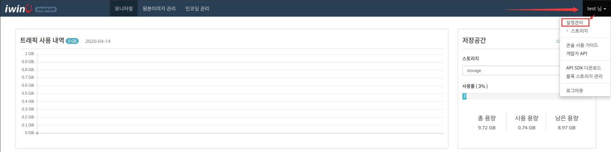
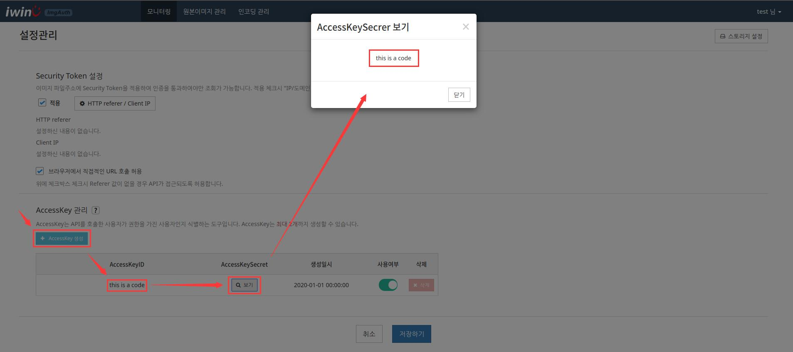
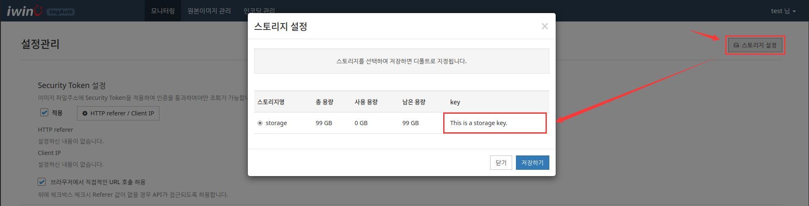

# Image Auth

SDK for iwinv image auth API.
SDK를 사용하면 편리하고 안전하게 API 연결을 할수있다.

## Setting

`/inc/image.inc` 파일은 기본설정파일이다.

*  Image 인증(단독형) 서비스의 도메인 `/inc/image.inc` 의 `apiDomain`로 설정한다.
* API 버전을 `/inc/image.inc`의`version`로 설정한다.

* 아래 그림과 같이 **콘솔**에서 `사용자명` 메뉴 -> `설정&관리` -> `AccessKey 관리` 에서 accesskey를 생성하며
**accesskey ID** 과 **secret**를 `/inc/image.inc`의`accesskeyId`,`accesskeySecret` 로 설정한다.

  

  

* 아래 그림과 같이 **콘솔**에서 `사용자명` 메뉴 -> `설정&관리` -> `스토리지 설정`창에서 **storageKey**를 `/inc/image.inc`의`storageKey`로 설정한다.

  

## Image.php

**Class**에서 아래와 같이 **Method**를 포함하여 호출해서 사용할수 있다.

* `callAPI ()` -> API 요청. ( `/inc/image.inc` 설정필요 )
* `folderSelect ( $folder_key )` -> 폴더 목록 검색.
* `imageList ( $key )` -> 이미지 리스트 검색.
* `imageDetail ( $ImageKey )` -> 이미지 상세 검색.
* `imageDelete ( $ImageKeys )` -> 이미지 삭제.

## 버전관리

최신버전은 `v1` 이다.
`/inc/image.inc`의 `version`로 설정한다.

